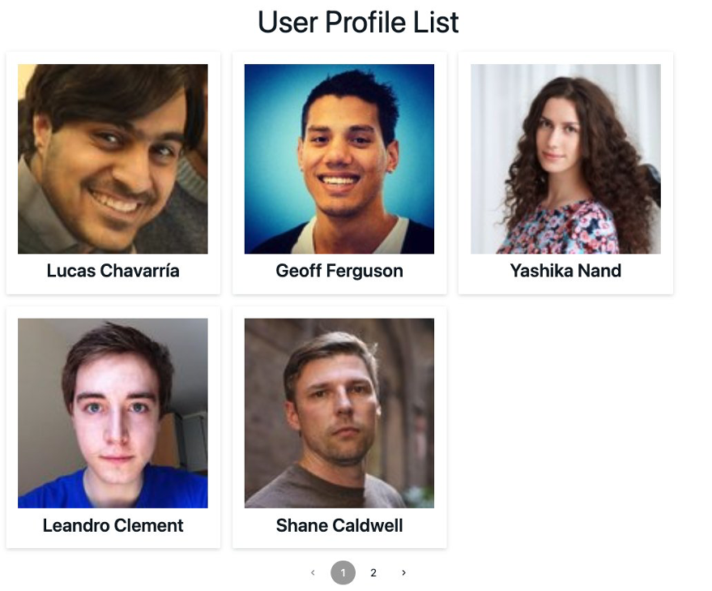

# Fetch Data from a DynamoDB Database with AWS Amplify

> This repo is part of a fullstack application. The backend can be found [here](https://github.com/focusOtter/cdk-appsync-guests).

Using a NextJS app with the [AWS Amplify JavaScript libraries](https://docs.amplify.aws/lib/q/platform/js/), we can hook into AWS resources. This frontend demonstrates hooking into an AppSync API that is protected with the an API Key.

```ts
// replace with your own keys
Amplify.configure({
	aws_project_region: 'us-east-1',
	aws_appsync_graphqlEndpoint:
		'https://c4wds3boinhrdemdnqkt5uztny.appsync-api.us-east-1.amazonaws.com/graphql',
	aws_appsync_region: 'us-east-1',
	aws_appsync_authenticationType: 'API_KEY',
	aws_appsync_apiKey: 'da2-ze45yo5nm5dttnnsvkyoxwbbvq',
})
```

In addition to configuring our frontend, the Amplify libraries also provide several ways to [call our backend](https://github.com/focusOtter/appsync-apikey-pagination-frontend/blob/main/pages/index.js#L12-L28) depending on how much or little we want our frontend to make use of Amplify:

```ts
//alternatively, run the following commands in your terminal:
// 1. npm i -g @aws-amplify/cli -g
// 2. amplify init -y
// 3. amplify add codegen --apiId YOUR-API-ID 😎
const fetchUsersQuery = `
  query ListUsers($limit: Int, $nextToken: String) {
    listUsers(limit: $limit, nextToken: $nextToken) {
      items {
        userId
        firstname
        lastname
        picture
      }
      nextToken
    }
  }
```

Note the `nextToken` field. This will return a token if there are more users available. This is how pagination is done in GraphQL.

For styling the [AWS Amplify UI library])(https://ui.docs.amplify.aws/) is used to create the following page when the application is run with `npm run dev`:



## Content Created

- AWS blog post: [Secure AWS AppSync with API Keys using the AWS CDK](https://aws.amazon.com/blogs/mobile/secure-aws-appsync-with-api-keys-using-the-aws-cdk/)
